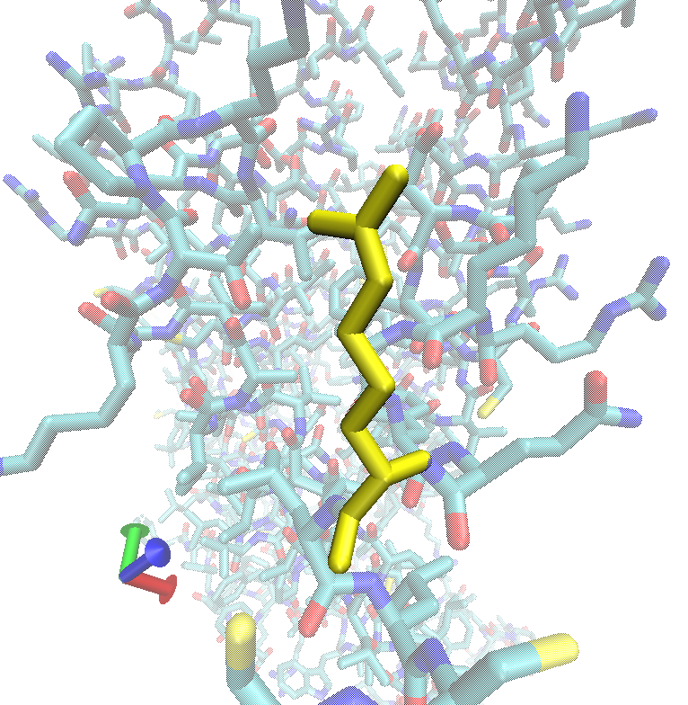

# Unraveling the Potential of the ADRB1 Gene Variant in Congestive Heart Failure Management through Exome Sequencing Analysis of the 1000 Genomes Project Data

Dylan Patel, Peter Yao, Celine Zhang

<aside>
📌 Exome sequencing data from the 1000 Genomes Project was analyzed to identify disease-associated genetic variants. After filtering and annotation, 189,349 variants were identified, with 12,835 being exonic. Among the exonic variants, 5,133 were nonsynonymous, and 5,892 were synonymous. Three variants with potential implications for human health and disease were highlighted, including a KCNJ11 gene mutation associated with exercise stress response, a VPS13B gene mutation associated with Cohen syndrome, and an AHSG gene mutation associated with Alopecia-Intellectual Disability Syndrome. Limitations of the study include the accuracy and reliability of detecting variants and the focus on coding regions of the genome.

</aside>

# Background

Personal genomics is a transformative discipline that revolutionizes healthcare, biomedicine, and the understanding of human genetics. It encompasses the sequencing, analysis, and interpretation of an individual’s genome. It has garnered much attention due to its potential to identify genetic risk factors for diseases, pharmacogenomics, and precision medicine. Next-generation sequencing (NGS) has become a cornerstone technology in this context.

NGS refers to a suite of high-throughput sequencing technologies that enables rapid sequencing of large volumes of DNA or RNA molecules. It has propelled personal genomics by making it more affordable and accessible to sequence individual genomes. Unlike the traditional Sanger sequencing method, NGS platforms can perform massively parallel sequencing, thus dramatically reducing the cost and time required to sequence an entire genome.

Whole exome sequencing (WES), or exome sequencing, is a process that sequences all the protein-coding areas, known as exons, in a genome [8]. The human exome constitutes 1-2% of the genome and comprises the coding regions or exons responsible for protein synthesis. Specific probes are used to isolate exons from the genomic DNA through exome capture. Next, the captured DNA is sequenced using NGS technologies.

Exome sequencing is particularly relevant for studying genetic disorders as many known disease-causing mutations are located in coding regions. Unlike techniques such as SNP arrays, which can only detect common genetic variations shared by many individuals, exome sequencing can identify unique variations, making it more efficient at identifying all genetic variations in a person's genes [8]. Additionally, prenatal whole exome sequencing can enhance diagnostic capabilities in fetuses with sonographic abnormalities, which in turn can produce a more informed diagnosis and treatment for families [3].

Outside of exome sequencing, it is also important to understand the non-protein coding genes, specifically tRNA and rRNA. These DNA sections are difficult to identify because they don’t have Open Reading Frames and are often small. DNA sequencing techniques have allowed us to identify and study these regions in the DNA and help us learn more about the non-coding regions in the DNA [6].

# Objectives

In this project, our primary objectives are to analyze and interpret a subset of NGS data derived from exome sequencing obtained from the 1000 Genomes Project. Our specific goals include:

1. **Understanding the contents of raw NGS files:** We will explore the raw data files containing the sequences obtained from NGS.
2. **Aligning raw NGS reads to the human genome (Alignment):** Alignment maps the short DNA sequences (reads) back to the reference genome. This step is crucial for understanding the location and context of each read.
3. **Identifying single nucleotide variants (SNV) and insertion-deletion (indel) mutations (Genotyping):** Genotyping is the process of determining the genetic variants an individual has. SNVs are single base changes, whereas indels are small insertions or deletions.
4. **Annotating these variants with biologically pertinent information (Annotation):** Annotation involves adding information about the biological functions and potential implications of identified variants.
5. **Exploring the annotated variants for their potential roles in human disease:** Finally, we will analyze the annotated data to determine if any identified variants may be implicated in diseases.

We have chosen to utilize data from the 1000 Genomes Project because it is one of the most comprehensive repositories of human genetic variation, representing diverse populations. This diversity is crucial for a more accurate and holistic understanding of human genetics. The information gleaned from this project can be instrumental in diagnosing and treating genetic disorders across different ethnicities.

# Method

In this study, we undertook a systematic approach to analyze next-generation sequencing data from the 1000 Genomes Project. Below is a detailed elucidation of the methods and procedures employed:

1. **Data Retrieval and Preparation**
   - A new directory named “final-project-02” was created on Midway 2 scratch space.
   - Relevant files from computer assignment 10 were copied into this directory.
   - Assigned sequence data in the form of two `fastq` files (“\_1.fastq” and “\_2.fastq”) were retrieved from /project2/bios10007/sequences/seq02_HG01618.
   - Only the sequence files pertinent to the assigned sequence were copied, not the entire folder.
2. **Alignment with Burrows-Wheeler Aligner (BWA)**
   - Command Used: `bwa mem`
   - Parameters:
     - q (trims the sequence)
     - t (sets the number of threads)
     - p (speeds up runtime at the expense of memory)
   - Two suffix array index (sai) files were generated, which were then combined using the `sampe` function to form the best alignment as a binary alignment map (BAM).
   - The BAM file was sorted using `samtools`.
3. **Genotyping with SAMtools**
   - Command Used: `samtools mpileup`
   - Genotyping focused on positions where the sequence differed from the reference genome.
   - This process employed statistics and analysis of allele frequencies, and it involved quality checks.
   - A file containing information about single nucleotide polymorphisms (SNPs) was created.
   - Quality Control: Only reads with a Phred quality score of at least 50 were transferred to a high-quality file.
4. **Annotation with ANNOVAR**
   - Command Used: `annotate_variation.pl`
   - The following databases were utilized for annotation through ANNOVAR:
     - refGene (for gene-based annotation)
     - snp135 (for identifying known SNP sites)
     - gwascatalog (for linking to genome-wide association studies)
     - dbNSFP (for predicting the functional effects of non-synonymous SNPs)
     - clinvar_20170905 (for associating variants with clinical significance)
   - The annotation provided by ANNOVAR enriched the dataset by associating genetic variants with additional information such as mutation type, location in the DNA molecule, predicted functional effects, and clinical significance.
5. **Variant Selection**
   - Variants of interest were selected based on quality control metrics and biological relevance.
   - Online databases such as OMIM, NCBI, clinvar, and dbSNP were consulted to aid in the selection of variants.
6. **Job Submission**
   - Time Request: Times varying from 3 to 10 hours, depending on the job, were requested in the “--time” section of the SUBMIT script for all jobs using the `hh:mm:ss` format since the jobs were more extensive than previous assignments.

## Algorithm specifics

The alignment process was executed using the Burrows-Wheeler Alignment (BWA) tool, which accepts paired-end sequences and a prefix as parameters, and meticulously aligns these sequences to a reference human genome. The parameters included `-q` for sequence trimming, `-t` for setting the number of processing threads, and `-p` for optimizing runtime at the cost of increased memory usage.

### What is BWA?

The Burrows-Wheeler Aligner's Smith-Waterman Alignment (BWA-SW) is an algorithm designed to align long sequences up to 1Mb against a large sequence database, such as the human genome, using a few gigabytes of memory [4].

```bash
bwa mem -q -t <number_of_threads> -p <prefix> <reference_genome> <input_file_1.fastq> <input_file_2.fastq> > <output_file.sam>
```

The BWA tool generates two Suffix Array Index (sai) files containing possible alignment locations, which are then synthesized using the `sampe` function and sorted through Samtools to yield the optimal alignment.

### What is SAMtools?

SAMtools is a library and software package designed for parsing and manipulating alignments in the Sequence Alignment/Map (SAM) format. It can convert from other alignment formats, sort and merge alignments, remove PCR duplicates, generate per-position information in the pileup format, call SNPs and short indel variants, and show alignments in a text-based viewer [5].

```bash
samtools view -bS <output_file.sam> | samtools sort -o <sorted_output.bam>
```

Following alignment, genotyping was performed to pinpoint the genomic positions at which the sequence deviates from the reference. This process relied on Bayesian statistics and an evaluation of allele frequencies, accompanied by quality assessments. Genotypes were filtered employing the PHRED quality score to exclude potentially erroneous sequence reads. We employed the Samtools Mpileup utility for genotyping and filtering, resulting in a file documenting single nucleotide polymorphisms (SNPs) that arise from insertions, deletions, or substitutions of nucleotides.

```bash
samtools mpileup -u -f <reference_genome> <sorted_output.bam> | bcftools call -c | vcfutils.pl varFilter -d 50 > <variants.vcf>
```

A PHRED quality score threshold of 50 was used for quality control. Subsequently, annotation was carried out using ANNOVAR to enrich the genetic data with additional information such as the mutation type, the DNA region encompassing the variant, and the rs number associated with the SNP. For annotation, databases including RefGene, SNP135, GWASCatalog, dbNSFP, and clinvar_20170905 were harnessed.

### What is ANNOVAR?

ANNOVAR is a command-line-driven software tool designed to annotate genetic variants from high-throughput sequencing data. It can annotate single nucleotide variants (SNVs) and insertions/deletions, examine their functional consequence on genes, infer cytogenetic bands, report functional importance scores, find variants in conserved regions, or identify variants reported in the 1000 Genomes Project and dbSNP [7].

```bash
./annovar/annotate_variation.pl -out <output_file> -buildver <build_version> -dbtype <database_name> <variants.vcf> humandb/
```

# Results

We identified 189349 total variants, 126595 of them being high-quality (PHRED score of 50 or higher). Of these high-quality variants, 117845 of them were SNPs, and 9010 of them were indel mutations. 12835 of the variants were exonic.

Out of the exonic variants, 5133 of them were nonsynonymous, and 5892 synonymous. There were 70 non-frameshift insertions, 88 non-frameshift deletions, 42 frameshift mutations, and 37 premature stop codons.

| RS Identifier | Gene   |
| ------------- | ------ |
| rs7460625     | VPS13B |
| rs149827237   | DYS    |
| rs56054534    | OTOF   |
| rs34373121    | SON    |
| rs4855271     | SI     |
| rs4917        | AHSG   |
| rs857691      | SPTA1  |
| rs6011        | F5     |
| rs7536561     | LHX4   |
| rs2032582     | ABCB1  |
| rs1799930     | NAT2   |
| rs10509681    | CYP2C8 |
| rs1801253     | ADRB1  |
| rs5219        | KCNJ11 |
| rs25487       | XRCC1  |

_Table 1. Legend matching RS Identifier to Gene_

| Gene: Function                                                                               | Location                         | Change in amino acids | Type of Variant      | Implications                                                             | PHRED Score |
| -------------------------------------------------------------------------------------------- | -------------------------------- | --------------------- | -------------------- | ------------------------------------------------------------------------ | ----------- |
| VPS13B: Protein sorting and transportation                                                   | Chromosome 8, Position 99121478  | Tyr → Stop            | Premature Stop Codon | Cohen Syndrome                                                           | 222         |
| DYSF (Dysferlin): Repairs muscle strains                                                     | Chromosome 2, Position 71515716  | Arg → Trp             | Nonsynonymous SNV    | Autosomal Recessive Limb-Girdle Muscular Dystrophy                       | 222         |
| OTOF: Hair cell exocytosis                                                                   | Chromosome 2, Position 26473506  | Arg → Gln             | Nonsynonymous SNV    | Autosomal Recessive Nonsyndromic Hearing Loss                            | 222         |
| SON: Promotes pre-mRNA splicing                                                              | Chromosome 21, Position 33576391 | Arg - Ser             | Frameshift Deletion  | ZTTK Syndrome                                                            | 185         |
| SI (Sucrase Isomaltase): Breaks down sugars                                                  | Chromosome 3, Position 164996744 | Met → Ile             | Nonsynonymous SNV    | Sucrase-Isomaltase Deficiency                                            | 225         |
| AHSG: Promotes proliferation of bladder cancer cells                                         | Chromosome 3, Position 186619924 | Met → Thr             | Nonsynonymous SNV    | Alopecia-Intellectual Disability Syndrome                                | 228         |
| SPTA1: Determines cell shape and organization of organelles                                  | Chromosome 1, Position 158656588 | Leu → Leu             | Synonymous SNV       | Hereditary spherocytosis type 3, Elliptocytosis 2                        | 222         |
| F5: Manufactures Factor V, part of the coagulation system                                    | Chromosome 1, 169530940          | Thr → Ser             | Nonsynonymous SNV    | Factor V Deficiency, Abnormal Bleeding, Thrombocytopenia, Thrombophilia  | 222         |
| LHX4(LIM Homeobox 4): Control development of the pituitary gland                             | Chromosome 1, 180274389          | Asn → Ser             | Nonsynonymous SNV    | Short stature-pituitary, Cerebellar defects-small sella turcica syndrome | 222         |
| ABCB1(P-gp): Multidrug resistance                                                            | Chromosome 7, 87531302           | Ser → Ala             | Nonsynonymous SNV    | Inflammatory bowel disease 13, Tramadol Response                         | 228         |
| NAT2(N-acetyltransferase): Response to drugs                                                 | Chromosome 8, 18400593           | Arg → Gln             | Nonsynonymous SNV    | Slow acetylation due to N-acetyltransferase enzyme variant               | 200         |
| CYP2C8(Cytochrome P450: Metabolism of xenobiotics                                            | Chromosome 10, 95038992          | Lys → Arg             | Nonsynonymous SNV    | CYP2C8 HAPLOTYPE POLYMORPHISM                                            | 222         |
| ADRB1(Adrenoceptor Beta 1): Mediates epinephrine hormone and norepinephrine neurotransmitter | Chromosome 10, 114045297         | Gly → Arg             | Nonsynonymous SNV    | Congestive heart failure and beta-blocker response, modifier of          | 162         |
| KCNJ11: Produces subunits of ATP-sensitive potassium channel                                 | Chromosome 11, 17388025          | Lys → Glu             | Nonsynonymous SNV    | Diabetes mellitus type 2, Exercise stress response                       | 222         |
| XRCC1(X-Ray Repair Cross Complementing): DNA repair                                          | Chromosome 19, 43551574          | Gln → Arg             | Nonsynonymous SNV    | Platinum compounds response - Efficacy                                   | 225         |

_Table 2: Information on selected variations (function, location, changes in variant, etc.)_

Among the variants identified, we highlight three that are particularly interesting due to their potential implications for human health and disease:

1. **Chromosome 11: Position 17388025 (KCNJ11 Gene)**:
   - Type of variant: Non-synonymous Single Nucleotide Variant (SNV).
   - Amino acid change: Lysine to Glutamic acid (often abbreviated as Glu).
   - Potential implications: This particular mutation is located in the KCNJ11 gene, which encodes a protein that forms potassium channels in pancreatic cells. The mutation is intriguing as it affects exercise stress response. Additionally, variants in the KCNJ11 gene have been associated with neonatal diabetes and may contribute to type 2 diabetes.
   - rsID: `rs5219`
   - Allele frequency in populations: 64.5%
2. **Chromosome 8: Position 71515716 (VPS13B Gene)**:
   - Type of variant: Nonsense mutation introducing a premature stop codon.
   - Amino acid change: Tyrosine to Stop codon (Termination of translation).
   - Potential implications: The mutation is in the VPS13B gene, which is crucial for the proper functioning of cells. The introduction of a premature stop codon leads to a truncated protein, causing Cohen syndrome, characterized by developmental delay, intellectual disability, microcephaly, and weak muscle tone.
   - rsID: `rs7460625`.
   - Allele frequency in populations: 78.5%.
3. **Chromosome 3: Position 186619924 (AHSG Gene)**:
   - Type of variant: Non-synonymous Single Nucleotide Variant (SNV).
   - Amino acid change: Methionine to Threonine.
   - Potential implications: The AHSG gene is known to encode a protein involved in inhibiting calcification in soft tissues and stimulating insulin receptor function. The mutation in this gene can lead to Alopecia-Intellectual Disability Syndrome, which is characterized by hair loss and intellectual challenges. Additionally, variations in the AHSG gene have been implicated in insulin resistance and cardiovascular disease.
   - rsID: `rs4917`.
   - Allele frequency in populations: 67.5%.

## Figures


Fig 1. Number of mutations vs. chromosome number


Fig 2. Number of exonic mutations vs. chromosome number.

Figures 1 and 2 show the number of mutations and exonic mutations on each chromosome; however, they are not statistically meaningful without knowing the size of each chromosome.


Fig 3. Types of variations


Fig 4. Types of variations excluding synonymous and non-synonymous SNVs

These pie charts show the proportions of different types of variations across all chromosomes. The vast majority of mutations are synonymous and nonsynonymous single nucleotide variations (SNVs), with the rest of the variations being fairly evenly divided.


Fig 5. Size of chromosome vs. number of mutations


Fig 6. Size of chromosome vs. number of exonic mutations

Figures 5 and 6 show a linear relationship between the size of a chromosome and the number of mutations on that chromosome. This relationship makes sense because there is a random chance of a mutation happening to each nucleotide, so each additional nucleotide adds to the likely number of mutations.


Fig 7. Number of genes vs. number of mutations on each chromosome


Fig 8. Number of genes vs. number of exonic mutations on each chromosome

Figures 7 and 8 show a linear relationship between the number of genes and the number of mutations on a given chromosome. This makes sense for the same reason that Figures 5 and 6 make sense - more genes generally mean more nucleotides, which generally means more mutations.


Fig 9. Number of intronic mutations vs. number of mutations


Fig 10. Number of exonic mutations vs. number of intronic mutations

Figure 9 shows a linear relationship between the number of intronic mutations and the number of total mutations, while Figure 10 shows a linear relationship between the number of exonic mutations and the number of intronic mutations. These relationships show that there is a somewhat constant ratio between the number of intronic mutations, exonic mutations, and total mutations across all chromosomes. This makes sense because when finding these ratios, the absolute size of the chromosome does not matter, only the relative sizes of the chromosome’s introns and exons, which should be fairly constant across all chromosomes.

# Discussion

One of the most interesting variants in this study is found in the ADRB1 gene, which is located on chromosome 10 at position 114045297. The variant is a nonsynonymous single nucleotide variant (SNV) where guanine (G) is replaced with cytosine (C).



Fig 11. Visualization of the ADRB1 arginine mutation in VMD

## **ADRB1 Gene and its Protein**

ADRB1 gene encodes for Beta-1 adrenergic receptor (β1-adrenoceptor), which is a protein belonging to the family of G protein-coupled receptors. This receptor is predominantly expressed in the heart and is critically involved in mediating the effects of the hormones epinephrine and norepinephrine. Through the activation of G-proteins, the Beta-1 adrenergic receptor increases the heart rate, contractility, and cardiac output as part of the fight or flight response. It is a key regulator of the sympathetic nervous system’s actions in the heart.

### **Implications of the Variant**

This particular G to C mutation in the ADRB1 gene is associated with congestive heart failure and response to beta-blockers, a class of medications that are commonly used to treat heart conditions. Beta-blockers work by blocking the action of epinephrine and norepinephrine on Beta-1 adrenergic receptors, thereby reducing heart rate and blood pressure.

The mechanistic role of this mutation in disease seems to be a modifier of the patient’s response to beta-blockers. It is known that variants in the ADRB1 gene can affect the structure and function of the Beta-1 adrenergic receptor and thereby influence how effectively beta-blockers can interact with and inhibit the receptor.

## **Protein Structure and Function**

The Beta-1 adrenergic receptor has seven transmembrane domains, typical of G protein-coupled receptors, and is involved in several biological pathways, including adrenergic signaling in cardiomyocytes. The mutation can affect the structure and, consequently, the function of the protein. The paper by Parvez et al. provides evidence that two common genetic variants in the gene encoding the β-1-adrenergic receptor (ADRB1) are associated with ventricular rate control in response to treatment in patients with atrial fibrillation [2]. The study used data from the Vanderbilt AF Registry and found that 54% of the 543 Caucasian subjects responded to β-blockers, calcium channel blockers, and/or digoxin therapy within 6 months according to AFFIRM criteria [2]. However, it's important to note that drug prescription is not synonymous with drug compliance. If validated, this study could be a major step forward for cardiovascular electrophysiology pharmacogenomics and could potentially be translated into clinical practice.

### **Impact on the Patient**

For patients with this mutation, it might be necessary to adjust the medication strategy, as standard beta-blocker treatments may not be as effective. The mutation could potentially also be associated with an altered course of heart failure.

In conclusion, this variant in the ADRB1 gene is of clinical significance, particularly in the context of managing congestive heart failure and personalizing treatment strategies with beta-blockers. Understanding such genetic variants can have direct implications for precision medicine and patient care.

## Limitations of study

A key consideration in NGS is the PHRED score, which calculates the quality of the nucleotides generated by DNA sequencing. Sequences with a low PHRED score are typically deemed unreliable and are not utilized as dependable data sources. Despite NGS's speed and efficiency, the process is prone to errors during nucleotide replication, meaning the data produced may not always be perfectly accurate.

On the other hand, exome sequencing may fail to detect certain types of mutations, such as large genomic rearrangements, extensive deletions, and sizable insertions. Moreover, mutations that occur outside of protein-coding regions, which can still contribute to disease development, may not be detected by exome sequencing due to its exclusive focus on the coding regions of the genome.

In general, personal genomics can be controversial due to the highly private nature of an individual’s genome. There is much room for ethical debate over how much, if any, of an individual’s genome should be accessible to medical professionals and corporations since misuse of this data, or an insecure database, can be extremely dangerous for the individual’s safety and privacy [1].

Knowing these variants may be extremely beneficial in a clinical setting because this knowledge may allow for early diagnosis of diseases based on an individual’s genome.

Some other limitations include:

- The accuracy and reliability of detecting variants depend on the sequencing depth. If the sequencing depth is not sufficient, there may be false negatives or positives.
- Sometimes, during the capturing step in exome sequencing, one allele may be preferentially captured over another, leading to allele dropout and subsequently to false homozygosity calls.

# Conclusion

In this study, we performed a comprehensive analysis of exome sequencing data from the 1000 Genomes Project for disease-associated genetic variants. Using the Burrows-Wheeler Alignment (BWA) tool and SAMtools, we identified a total of 189,349 variants, of which 126,595 were high-quality. We used ANNOVAR to annotate the genetic data with additional information and identified several genetic variants with potential implications for human health and disease. Among these, the ADRB1 gene variant is of particular interest due to its potential implications for managing congestive heart failure and personalizing treatment strategies with beta-blockers.

While the study has its limitations, including the accuracy and reliability of detecting variants and the focus on coding regions of the genome, the knowledge gained from identifying these variants may be extremely beneficial in a clinical setting. Early diagnosis of diseases based on an individual's genome can have profound implications for patient care and personalized medicine.

Overall, our analysis highlights the importance of using exome sequencing data to identify genetic variants that may impact human health and disease. With continued advances in sequencing technology and data analysis tools, we can continue to expand our understanding of the role genetic variants play in health and disease.

# References

[1] Brothers, K. B., & Rothstein, M. A. (2015). Ethical, legal and social implications of incorporating personalized medicine into healthcare. _Personalized Medicine_, _12_(1), 43–51.

[2] Cresci, S. 2012. _ADRB1 Variants in Atrial Fibrillation_. _59_(1), 57–59.

[3] Jelin, A. C., & Vora, N. 2018. Whole exome sequencing: Applications in Prenatal Genetics. _Obstetrics and Gynecology Clinics of North America_, _45_(1), 69–81.

[4] Li, H., & Durbin, R. 2010. Fast and accurate long-read alignment with Burrows–Wheeler transform. _Bioinformatics_, _26_(5), 589–595.

[5] Li, H., Handsaker, B., Wysoker, A., Fennell, T., Ruan, J., Homer, N., Marth, G., Abecasis, G., & Durbin, R. 2009. The Sequence Alignment/Map format and SAMtools. _Bioinformatics_, _25_(16), 2078–2079.

[6] Pevsner, J. 2015. _Bioinformatics and functional genomics_. Wiley Blackwell.

[7] Wang, K., Li, M., & Hakonarson, H. 2010. ANNOVAR: functional annotation of genetic variants from high-throughput sequencing data. _Nucleic Acids Research_, _38_(16), e164–e164.

[8] Warr, A., Robert, C., Hume, D., Archibald, A., Deeb, N., & Watson, M. 2015. Exome Sequencing: Current and Future Perspectives. _G3: Genes|Genomes|Genetics_, _5_(8), 1543–1550.
